# FPGA-Based Lane Detection and Closed-Loop Lane Keeping

Closed-loop lane keeping for an autonomous vehicle, built in **MATLAB/Simulink** and tested with
**FPGA-in-the-loop** image processing on a **Digilent Basys 3 (Artix-7)** board.

A virtual camera mounted on a simulated car (Unreal Engine scene, Automated Driving Toolbox) sees the road.
Each frame is corrected, projected to a bird's-eye view, segmented, fitted with a lane model and fed to a
**Pure Pursuit** controller, whose steering angle drives a **kinematic bicycle model** that moves the car
in the 3D scene: the loop is closed. The lane-segmentation stage can run either in Simulink or on the FPGA,
connected over UART, so the two can be compared on the same scenarios.

> Course project for *Automation and Control in Autonomous Vehicles* (ACAV), Politecnico di Milano,
> a.y. 2025/2026. Team: Alessandro Alemagna, Mauro Ingenito ([@Mauroing02](https://github.com/Mauroing02)),
> Giorgio Corneo ([@giorgio-corneo](https://github.com/giorgio-corneo)).

**Presentation:** [project slides (PDF, 26 pages)](docs/presentation.pdf) with assumptions, design and results.

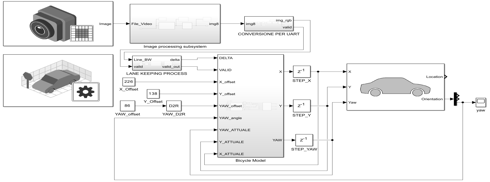

## Pipeline

| Stage | What it does | Code |
|---|---|---|
| 1. Image processing | Lens distortion correction, region of interest, bird's-eye view (BEV, 256×256 px = 10×10 m) | [`matlab/1_image_processing`](matlab/1_image_processing) |
| 2. Lane segmentation | RGB → gray, Gaussian smoothing, gradient + threshold to a binary line image | [`matlab/2_lane_segmentation`](matlab/2_lane_segmentation) |
| 3. Lane keeping control | Noise cleanup, lane masking, left/right lane fit, parabolic centerline `x(y) = a·y² + b·y + c`, Pure Pursuit with 5 m look-ahead | [`matlab/3_lane_keeping_control`](matlab/3_lane_keeping_control) |
| 4. Vehicle model | Kinematic bicycle model (wheelbase 3 m) integrating position and yaw | [`matlab/4_vehicle_model`](matlab/4_vehicle_model) |
| 5. FPGA link | RGB 8→7 bit packing, UART packetizer / depacketizer between Simulink and the board | [`matlab/5_fpga_uart_link`](matlab/5_fpga_uart_link), [`fpga`](fpga) |

All image processing and control code is written from scratch in plain MATLAB (no toolbox functions)
and is `%#codegen`-compatible, so it runs inside Simulink *MATLAB Function* blocks.

<details>
<summary>Subsystems in Simulink</summary>

**Image processing**
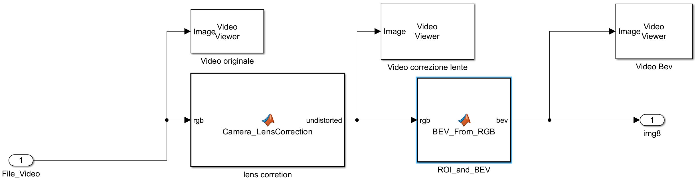

**Lane segmentation**
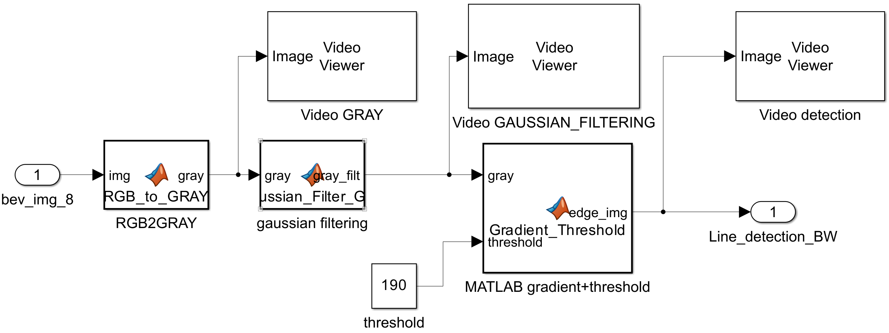

**Lane keeping control**
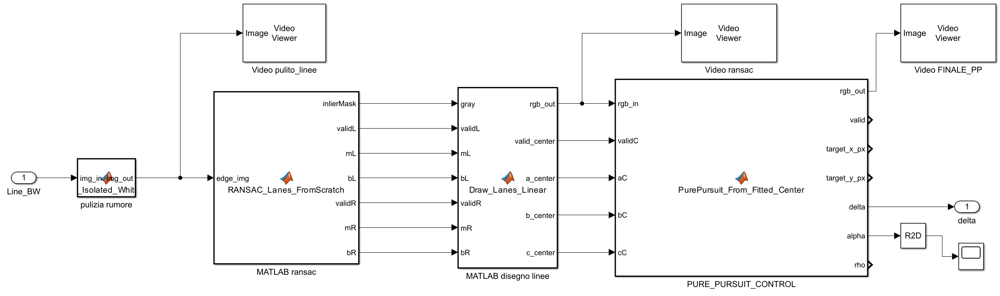

**Bicycle model**
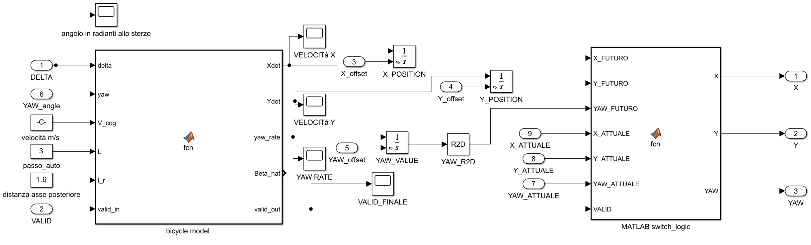

**FPGA UART link**
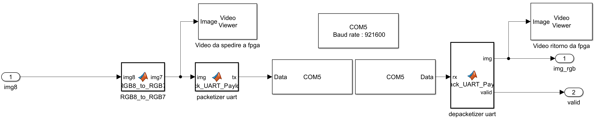

</details>

## FPGA in the loop

Frames are packed and sent over UART to the Basys 3, where the line-detection stage runs in hardware
(Vivado block design below); the filtered frame comes back to Simulink and continues through the pipeline.

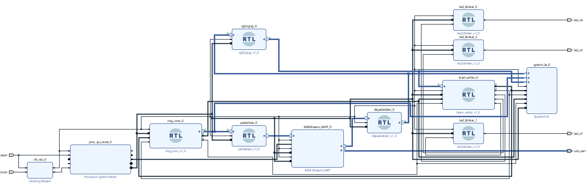

From left to right: frame sent to the FPGA, frame returned, filtered, lane mask, rotated, Pure Pursuit target.

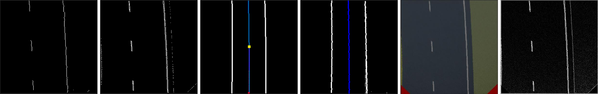

## Results

Closed-loop simulations on straight and curved roads, at 136.5 km/h and at 18 km/h, comparing the
pure-Simulink loop with the FPGA-in-the-loop version.

| Straight road | Curved road |
|---|---|
| 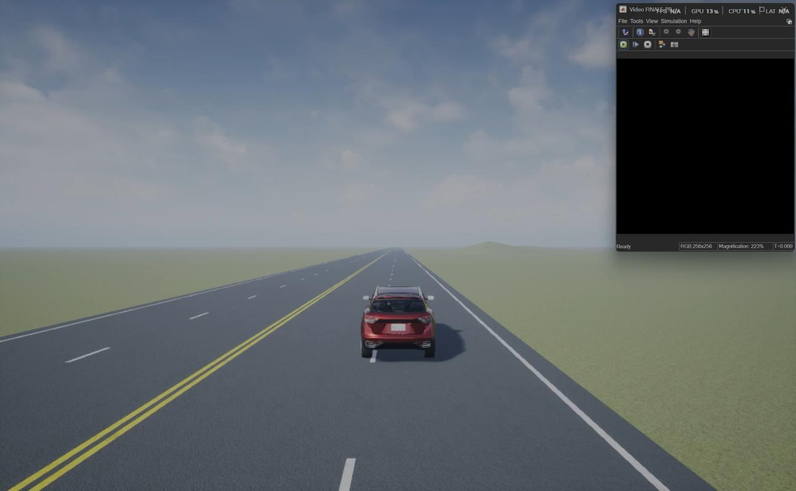 | 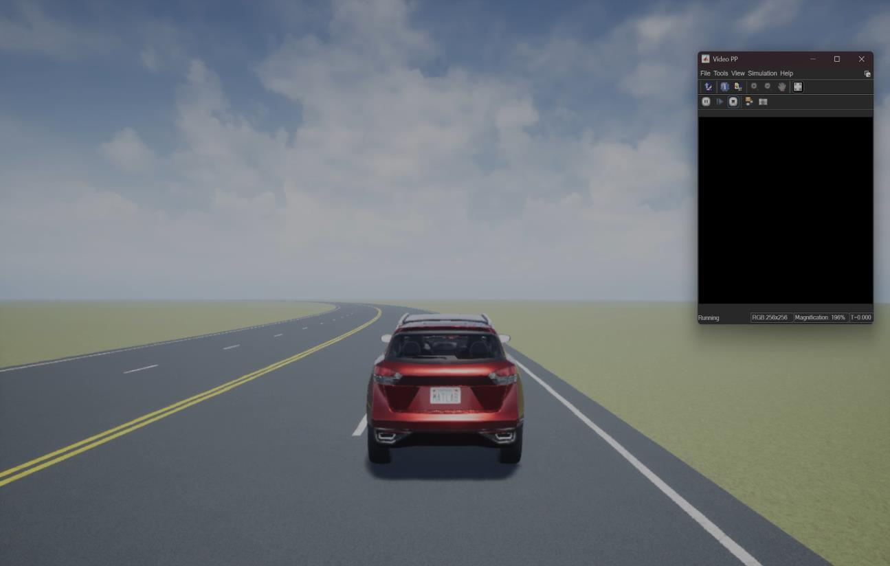 |

Steering angle: Simulink loop vs FPGA in the loop.

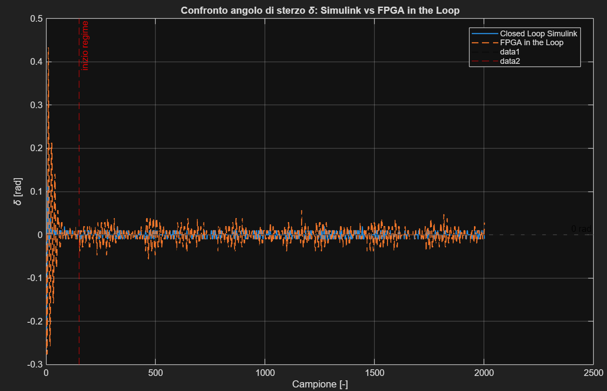

Lateral error from the lane centerline.

| Simulink loop | FPGA in the loop |
|---|---|
| 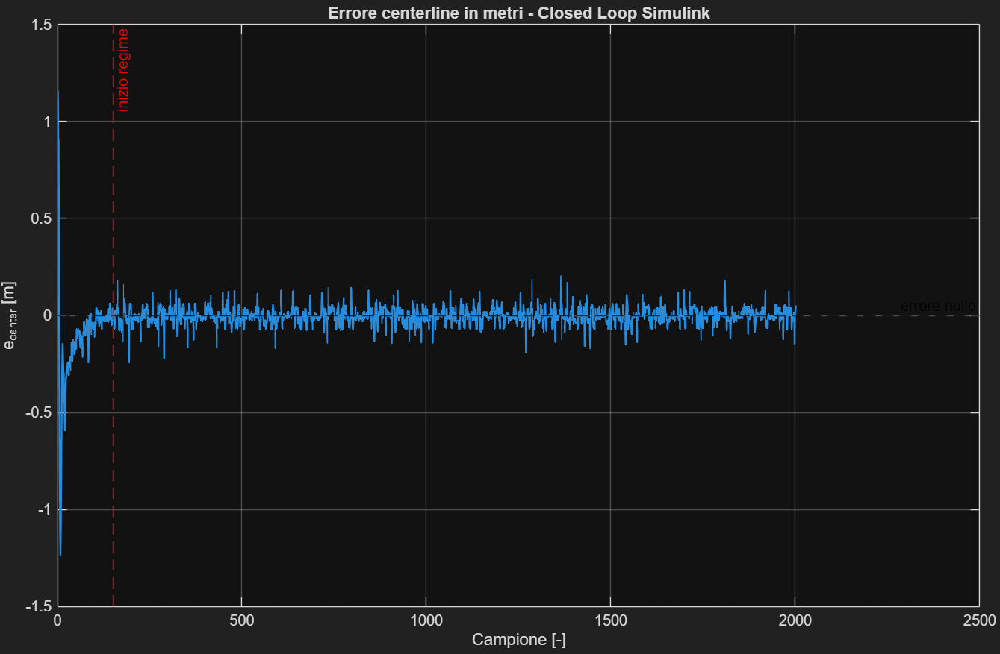 | 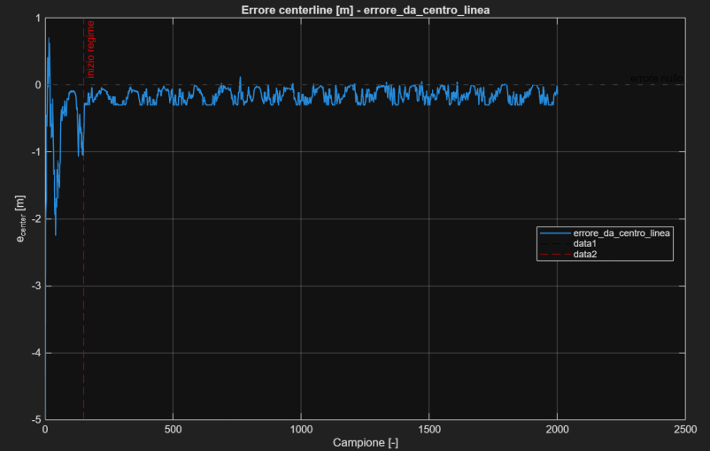 |

## Repository layout

```
simulink/   lane_keeping_fpga_in_the_loop.slx   the complete model (MATLAB R2025b)
matlab/     code of every MATLAB Function block, extracted for reading on GitHub
fpga/       VHDL written for the project (UART depacketizer, FIFO) and Basys 3 pin constraints
docs/       project presentation (PDF) and the figures used in this README
```

The FPGA design builds on the image-processing modules of a *Digital Electronic Systems Design* lab
(BRAM controller, RGB-to-gray, convolution, packetizer). Those modules belong to the course and are not
included here; `fpga/` contains only the parts written for this project.

## Running the model

Requirements: MATLAB and Simulink **R2025b**, Automated Driving Toolbox (3D simulation),
Computer Vision Toolbox, Instrument Control Toolbox (serial link, only for FPGA in the loop).

1. Open `simulink/lane_keeping_fpga_in_the_loop.slx`.
2. Run the simulation: the Unreal Engine scene starts automatically.
3. For FPGA in the loop, program the Basys 3 with the design and set the serial port in the
   *Serial Configuration* block (default `COM5`).

## License

[MIT](LICENSE) © 2026 Alessandro Alemagna, Mauro Ingenito, Giorgio Corneo.
The course-provided FPGA modules mentioned above are not covered by this license and are not included.
